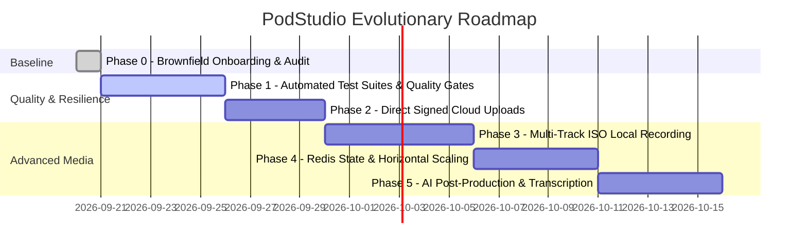

# Project Roadmap

**Project:** PodStudio  
**Current Milestone:** Milestone 1 — Quality, Scalability & Production Hardening  
**Last Updated:** 2026-09-20  

---

## Milestone 1: Production Hardening & Scalability

---

## Phase Breakdown

### Phase 0: Brownfield Onboarding & Codebase Mapping (COMPLETED)
- **Goal:** Ingest existing architecture, map components, document protocols, and establish `.planning/` baseline.
- **Deliverables:**
  - Complete 7-document codebase map in `.planning/codebase/`.
  - `.planning/PROJECT.md`, `REQUIREMENTS.md`, `ROADMAP.md`, `STATE.md`.
  - Onboarding summary in `.planning/onboarding/SUMMARY.md`.
- **Status:** ✅ Completed

---

### Phase 1: Automated Test Suites & Quality Gates
- **Goal:** Eliminate manual regression risks by introducing automated unit and integration tests across backend services and frontend custom hooks.
- **Key Tasks:**
  - Setup Vitest in `server` with Supertest for API endpoint testing.
  - Test `room.service.ts` OTP generation, expiry calculation, and lockout counters.
  - Test `auth.service.ts` and JWT verification middlewares.
  - Setup Vitest in `client` with `@testing-library/react` to test `useMedia`, `useSocket`, and `GuestJoinModal`.
- **Success Criteria:**
  - [ ] `npm test` runs in `server` with >80% coverage on auth, room, and OTP controllers.
  - [ ] Component unit tests verify guest OTP input logic and error states.

---

### Phase 2: Direct Signed Cloud Uploads & Media Optimization
- **Goal:** Eliminate large media file bottlenecks in the Node.js API server by allowing browsers to upload WebM blobs directly to Cloudinary via backend-signed signatures.
- **Key Tasks:**
  - Create `/api/recordings/sign-upload` endpoint generating Cloudinary SHA-1/SHA-256 signatures and timestamps.
  - Update `client/src/api/recording.ts` to upload directly to Cloudinary upload URL via Axios with upload progress.
  - Provide recording resolution selectors (720p @ 30fps vs 1080p @ 60fps) with framerate capping to reduce low-spec CPU thermal throttling.
- **Success Criteria:**
  - [ ] Client uploads 100MB+ recordings directly to Cloudinary without streaming through Express server memory.
  - [ ] CPU usage on canvas compositing reduced by up to 35% on standard hardware.

---

### Phase 3: Separate Multi-Track ISO Local Recording
- **Goal:** Support true Riverside-style local track recording where each peer records their own uncompressed audio and video locally, then uploads it to the session cloud bundle.
- **Key Tasks:**
  - Implement participant-side `MediaRecorder` capturing raw local mic and camera tracks.
  - Stream chunks or upload final individual tracks upon session conclusion.
  - Provide a multi-track download zip or cloud folder containing isolated track stems (host audio, guest audio, host video, guest video).
- **Success Criteria:**
  - [ ] Host and guest individual tracks are saved with synchronized start timestamps.
  - [ ] Zero audio compression artifacts from WebRTC network packet loss in the individual track stems.

---

### Phase 4: Production Resilience & Redis State
- **Goal:** Decouple Socket.IO realtime rooms and host disconnect grace timers from Node.js process memory to allow horizontal multi-instance scaling.
- **Key Tasks:**
  - Introduce `@socket.io/redis-adapter` with Redis connection configuration.
  - Persist active room host associations and grace timers in Redis or database transactions.
  - Health checks and graceful shutdown drains connected rooms without immediate dropped connections.
- **Success Criteria:**
  - [ ] Server can run in multi-replica cluster behind an Nginx or Render load balancer without dropped signaling packets.

---

### Phase 5: AI Post-Production & Transcription
- **Goal:** Provide automated value-add features for podcasters directly after recording.
- **Key Tasks:**
  - Connect audio stream to speech-to-text API (e.g. Whisper / Deepgram / Google Cloud Speech).
  - Generate automated time-coded transcripts, show notes, and chapter summaries in the recording dashboard.
- **Success Criteria:**
  - [ ] Recorded sessions generate downloadable `.vtt` / `.srt` captions and summarized episode notes.
