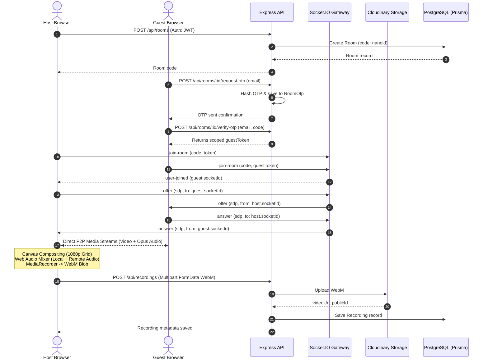

# System Architecture

**Project:** PodStudio  
**Domain:** High-Fidelity Remote Recording Studio  
**Generated Date:** 2026-09-20  

---

## 1. Architectural Style & Overview

PodStudio implements a **decoupled Client-Server architecture** with three primary communication planes:
1. **HTTP/REST Plane:** For authentication, room management, recording metadata persistence, and file uploads.
2. **WebSocket Realtime Signaling Plane:** Powered by Socket.IO for peer presence, connection handshakes, and session termination events.
3. **P2P WebRTC Media Plane:** Direct peer-to-peer audio/video mesh between connected browsers for zero-latency, full-fidelity communication.

In addition, recording is performed **locally in the host's browser** via Canvas compositing and Web Audio API mixing, then uploaded to Cloudinary once finalized.

---

## 2. High-Level Data Flow

---

## 3. Core Architectural Modules

### A. Client Architecture (`client/src`)

- **Routing & State (`App.tsx` & React Router 7):**
  - Public routes: `/`, `/login`, `/register`, `/join/:id`, `/sso-callback`.
  - Protected routes: `/home`, `/rooms/:id`, `/room/:id`, `/dashboard` wrapped in `<ProtectedRoute>`.
- **Custom Hooks Pipeline:**
  - `useAuth`: Unifies Clerk SSO and native JWT sessions with localStorage token caching.
  - `useMedia`: Acquires user media (`getUserMedia`) with audio/video device selection, mute, camera toggle, and cleanup.
  - `useSocket`: Manages Socket.IO lifecycle, reconnection, token passing in handshake auth, and event emitters.
  - `useWebRTC`: Manages dynamic `Map<string, RTCPeerConnection>`, queued ICE candidate flushing before `setRemoteDescription`, and track event subscriptions.
  - `useRecording`: Real-time 60fps canvas drawing loop (`requestAnimationFrame`) combining all active video elements into layout presets (1-peer, 2-peer side-by-side, 3x2 grid) and Web Audio mixer (`AudioContext`, `MediaStreamAudioSourceNode`, `ChannelMergerNode`).
- **Pages & Views:**
  - `landing.tsx`: Marketing landing page with hero CTA and direct guest room join input.
  - `Home.tsx`: Quick action launcher for creating studio rooms or entering existing rooms.
  - `Room.tsx`: The primary recording studio interface (participant dock, stage canvas, recording controller, device settings, session grace indicator).
  - `Dashboard.tsx`: Media asset library with animated stats, search, sorting, video playback preview, and Cloudinary deletion.

### B. Server Architecture (`server/src`)

- **Application Bootstrap (`server.ts`):**
  - Mounts CORS handler with dynamic origin validation.
  - Mounts Clerk middleware for hybrid JWT validation.
  - Initialises Socket.IO with JWT/guestToken handshake security.
  - Tracks in-memory state: `roomUsers`, `roomHosts`, `roomTerminationTimers`.
- **Controllers (`controllers/`):**
  - `auth.controller.ts`: Registration, login, current user profile, Clerk database sync.
  - `room.controller.ts`: Create room, join room, end room, OTP request, OTP verification.
  - `recording.controller.ts`: File upload handler, Cloudinary bridge, database record creation, deletion, renaming.
- **Middleware (`middleware/`):**
  - `auth.middleware.ts`: Validates Bearer token from native JWT or Clerk headers.
  - `rateLimit.middleware.ts`: Prevents brute-force on OTP verification and room creation.
- **Services (`services/`):**
  - `auth.service.ts`: User password hashing, lookup, and JWT generation.
  - `room.service.ts`: Prisma room creation, participant array mutations, OTP creation & verification.
  - `cloudinary.service.ts`: Cloudinary SDK uploader and deletion wrapper.
  - `email.service.ts`: Nodemailer transport configuration and email template compiler.

---

## 4. Key Architectural Patterns

1. **Targeted P2P Mesh Signaling:** Eliminates broadcast flooding by tagging WebRTC SDP signals with target socket IDs (`to`/`from`), allowing multi-party mesh connections without an expensive MCU or SFU media server.
2. **Buffering ICE Candidate Queue:** Solves the common WebRTC race condition where remote ICE candidates arrive before the answer SDP description is committed.
3. **Browser-Side Compositing:** The server never processes or transcodes raw video packets, dramatically reducing server bandwidth and CPU costs. All compositing happens client-side via hardware-accelerated Canvas & Web Audio.
4. **Host Disconnect Grace Period:** A 15-second server-side grace period tolerates accidental page refreshes or transient packet loss without immediately terminating guest calls.
5. **Zero-Trust OTP Authentication:** Guests are never granted full user records in the database, only time-limited cryptographic guest JWT tokens restricted to the single room ID.
