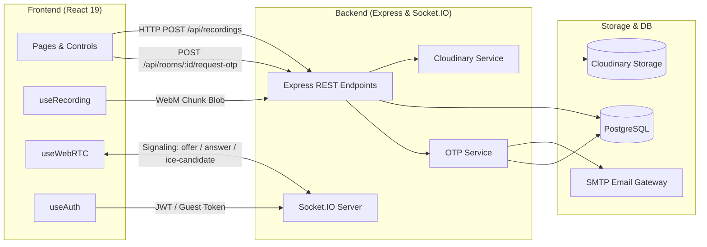

# Integrations & External Services

**Project:** PodStudio  
**Scope:** Third-party APIs, SDKs, Cloud Services, and Protocols  
**Generated Date:** 2026-09-20  

---

## 1. Cloud & External Services

### Cloudinary (`cloudinary` SDK v2)
- **Role:** Primary cloud media storage for master recordings (WebM/MP4).
- **Integration Points:**
  - `server/src/services/cloudinary.service.ts`: `uploadToCloudinary` uploads raw files from disk (Multer temp path) with `resource_type: "video"`.
  - `deleteFromCloudinary`: Deletes assets by public ID when recordings are deleted from the dashboard.
- **Configuration Keys:**
  - `CLOUDINARY_CLOUD_NAME`
  - `CLOUDINARY_API_KEY`
  - `CLOUDINARY_API_SECRET`
- **Folder Convention:** `riverside-recordings/recording-{timestamp}-{random}.webm`

### Clerk Authentication (`@clerk/clerk-react`, `@clerk/express`)
- **Role:** Managed creator identity and Single Sign-On (Google, GitHub, email).
- **Integration Points:**
  - `client/src/App.tsx`: `AuthenticateWithRedirectCallback` handling `/sso-callback`.
  - `client/src/hooks/useAuth.ts`: Intercepts Clerk session tokens and transparently syncs with backend database.
  - `server/src/server.ts`: Mounts optional `clerkMiddleware()` and parses Clerk JWT tokens in Socket.IO handshake.
  - `server/src/controllers/auth.controller.ts`: `syncClerkUser` upserts Clerk profiles into PostgreSQL `User` table.
- **Configuration Keys:**
  - Frontend: `VITE_CLERK_PUBLISHABLE_KEY`
  - Backend: `CLERK_PUBLISHABLE_KEY`, `CLERK_SECRET_KEY`

### Nodemailer / SMTP Email Service (`nodemailer` v10)
- **Role:** Dispatches 6-digit cryptographic OTPs for passwordless guest joins.
- **Integration Points:**
  - `server/src/services/email.service.ts`: Uses standard SMTP transport.
  - Development fallback: If SMTP credentials are omitted, OTPs log directly to stdout console for local testing without mail credentials.
- **Configuration Keys:**
  - `SMTP_HOST`, `SMTP_PORT`, `SMTP_USER`, `SMTP_PASS`, `SMTP_FROM`
  - `OTP_EXPIRY_MINUTES` (defaults to 5 minutes)
  - `OTP_MAX_ATTEMPTS` (defaults to 5 attempts)

### WebRTC STUN / TURN NAT Traversal
- **Role:** ICE candidate gathering and NAT/firewall hole-punching for multi-peer video streaming.
- **Default Public STUN Servers:**
  - `stun:stun.l.google.com:19302`
  - `stun:stun1.l.google.com:19302`
  - `stun:stun2.l.google.com:19302`
  - `stun:global.stun.twilio.com:3478`
- **Configurable TURN Relay Servers:**
  - Enabled via `VITE_TURN_URL`, `VITE_TURN_USERNAME`, `VITE_TURN_CREDENTIAL`.
  - Supports comma-separated multi-region TURN URLs (e.g. Metered.ca, Twilio Network Traversal, Xirsys).

---

## 2. Internal Service Boundaries & Communication

---

## 3. Webhook & Background Tasks

- **Host Disconnect Grace Timer:** 15-second in-memory timeout in `server/src/server.ts` before auto-terminating room sessions on host disconnect.
- **Prisma Transactions / Queries:** Direct ORM calls with `@prisma/adapter-pg` driver.
- **No External Message Queues:** Currently uses in-process JavaScript event timers and Socket.IO rooms rather than Redis or BullMQ.
