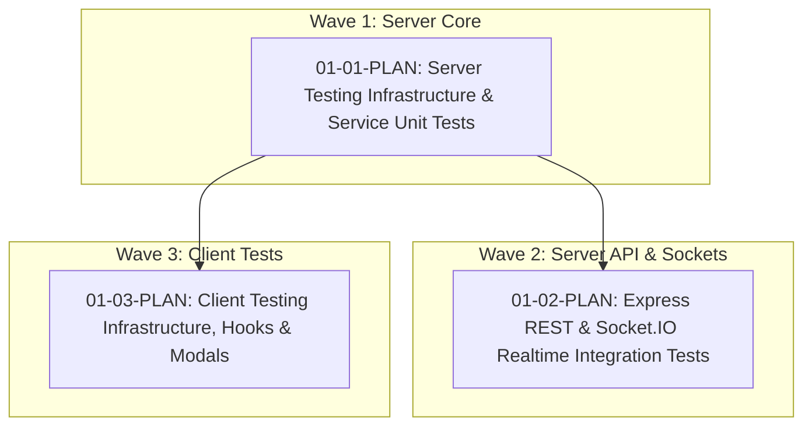

# Phase 1: Automated Test Suites & Quality Gates — Research

**Phase:** 1  
**Milestone:** 1 — Production Hardening & Scalability  
**Generated Date:** 2026-09-20  

---

## 1. Codebase Scouting & Architecture Findings

### A. Server (`/server`)
- **Current Entry Point (`server/src/server.ts`):**
  - Instantiates `app = express()` and `httpServer = createServer(app)`.
  - Immediately invokes `httpServer.listen(PORT)` at module level without an environment check.
  - Does not export `app` or `httpServer`, only `io` and `terminateRoomSession`.
  - **Required Adaptation:** Export `app` and `httpServer`. Wrap `httpServer.listen(...)` in a check `if (process.env.NODE_ENV !== 'test')` so tests can import `app` for Supertest without port binding collisions.
- **Prisma Strategy:**
  - `server/src/config/prisma.ts` exports singleton `prisma`.
  - In Vitest, we can mock `../config/prisma` using `vi.mock('../config/prisma', ...)` with deep mock methods or Vitest spy functions, allowing hermetic unit tests with zero database overhead.
- **Dependencies Needed:**
  - `vitest`
  - `supertest`
  - `@types/supertest`

### B. Client (`/client`)
- **Current Setup:**
  - Vite 8.1.1, React 19.2.7, TypeScript 6.0.2.
  - `vite.config.ts` uses `@tailwindcss/vite` and `@vitejs/plugin-react`.
- **Vitest Integration:**
  - Can configure Vitest directly in `vite.config.ts` via `test: { environment: 'jsdom', globals: true, setupFiles: './src/test/setup.ts' }`.
  - In `src/test/setup.ts`, import `@testing-library/jest-dom/vitest`.
- **Mocking Browser APIs:**
  - `navigator.mediaDevices.getUserMedia` needs a lightweight mock in `src/test/setup.ts` or per-test setup.
  - Web Audio `AudioContext` and HTMLCanvas `getContext('2d')` mocks will allow testing media hook lifecycle without headless GPU hardware.
- **Dependencies Needed:**
  - `vitest`
  - `jsdom`
  - `@testing-library/react`
  - `@testing-library/jest-dom`
  - `@testing-library/user-event`

---

## 2. Test Execution Plan & Wave Strategy

- **Wave 1 (Plan 01-01):** Server test harness, Prisma mocking, unit tests for Auth service, Room OTP service, and JWT utilities.
- **Wave 2 (Plan 01-02):** Express REST endpoints with Supertest, in-memory Socket.IO client/server signaling tests.
- **Wave 3 (Plan 01-03):** Client Vitest + JSDOM setup, `GuestJoinModal` OTP UI test, `useMedia` and `useSocket` hook unit tests.
